<div align="center">


**လင်းပြေကော်ဖီ — a full-stack cafe shop management system for Myanmar cafes**

[](https://linpyaecafe.kmnapps.xyz)


*Bilingual Myanmar-first (my/en) · PIN + email login · POS · Kitchen Display · Inventory · Reports*

</div>

---

## ✨ Watch it work — animated tour

Every animation below is a hand-built SVG (SMIL) living in [`assets/`](assets/) — no video files, no GIFs. They play right here on GitHub.

### 🧾 Point of Sale — tap items, cart builds itself


### 🔄 Order lifecycle — one ticket travels POS → Kitchen → Counter → Served

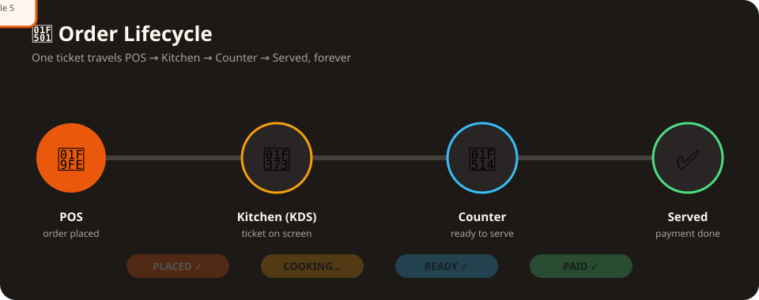

### 📊 Live dashboard — KPIs count up, charts draw themselves


---

## 📸 Real screenshots

Captured from the running production app (`linpyaecafe.kmnapps.xyz`).

| Login (PIN pad) | Dashboard |
|---|---|
| 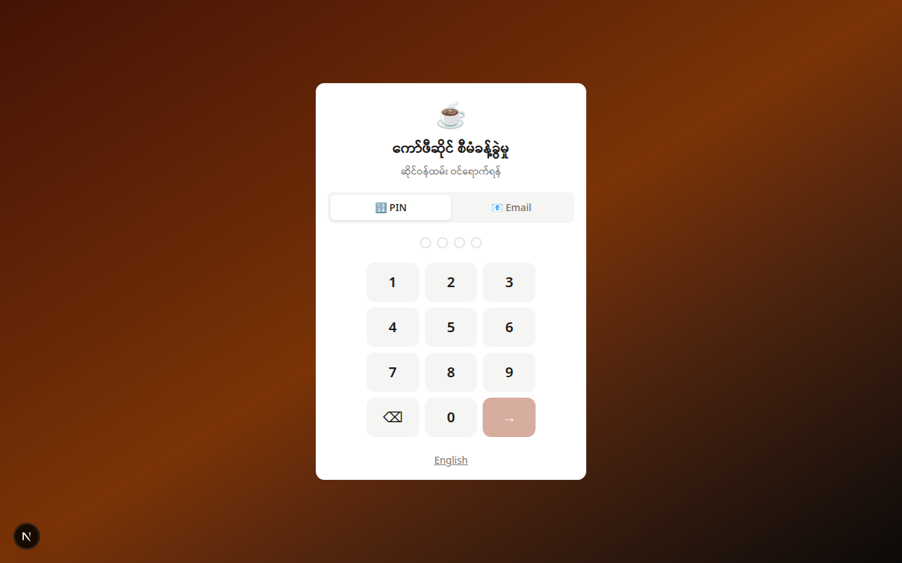 | 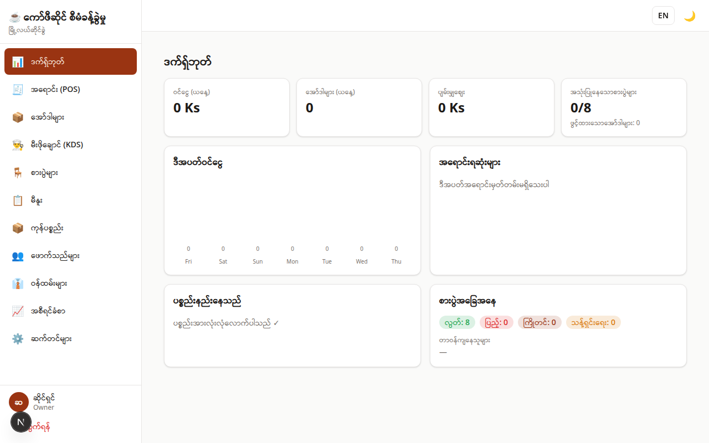 |

| POS | Kitchen Display (KDS) |
|---|---|
| 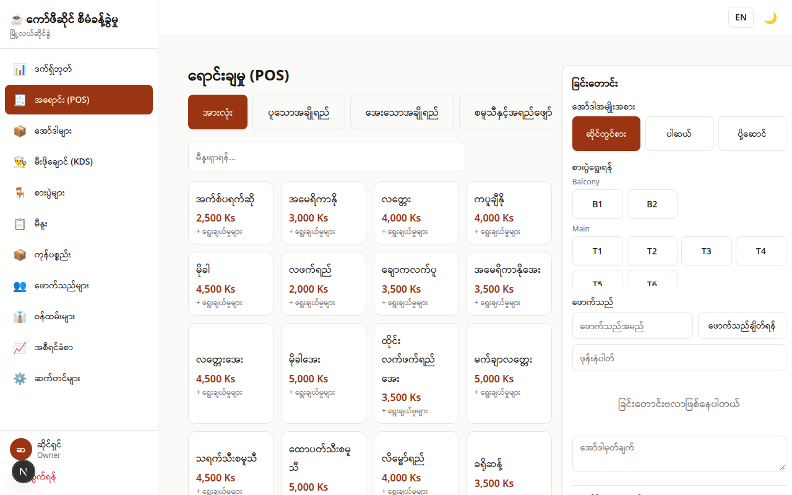 | 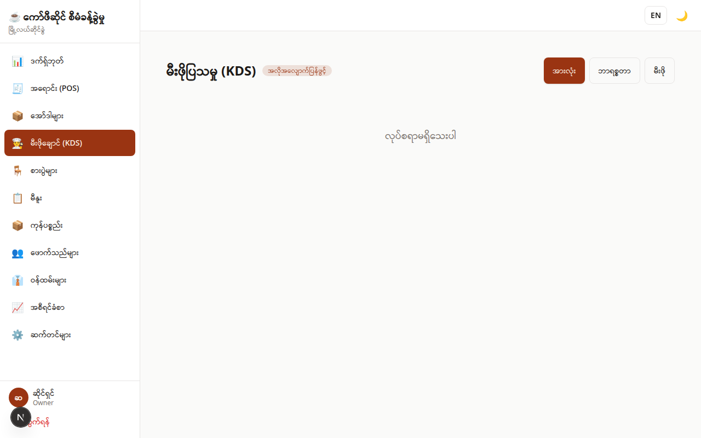 |

| Menu management |
|---|
| 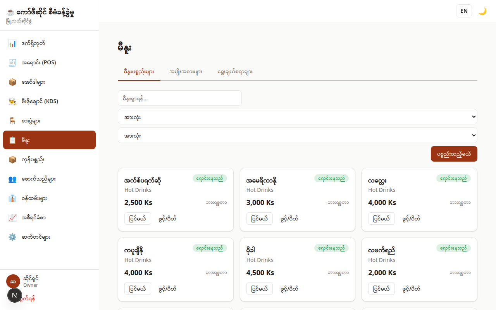 |

---

## 🧩 Eight modules, one system


| Module | What it does |
|---|---|
| 📊 Dashboard | KPIs, sales charts, low-stock alerts |
| 🧾 POS | Cart, modifiers, tables, customers, discounts, cash + split payments, change, receipts |
| 🍳 KDS | Auto-refreshing kitchen display, item progression |
| 🪑 Tables | Floor management, reservations, occupy/free |
| 📋 Menu | Categories, items, modifier groups, BOM (recipes) |
| 📦 Inventory | Ingredients, stock movements, purchase orders, receiving, low-stock |
| 👥 Customers | Search, order history, loyalty points, manual adjustments |
| 👔 Staff | Roles (owner/manager/cashier/barista), PIN login, attendance, rosters |
| 📈 Reports | Sales / items / categories / hourly / staff / inventory, CSV export, daily close |
| ⚙️ Settings | Shop profile, taxes, receipts, payment & SMS providers, audit logs |
| 🌐 Online | Public menu + cart + ordering (`/online`), KBZPay/WavePay webhook receivers |

Money is **MMK** (integer, no decimals). Timezone default `Asia/Yangon`.

> **Demo boundaries:** KBZPay/WavePay webhooks run in demo/sandbox mode until real webhook secrets are configured. SMS is a stub that logs instead of sending until a provider endpoint + API key is set.

---

## 🗄️ Data model

Prisma schema with animated relationship connectors — packets travel the relations forever.

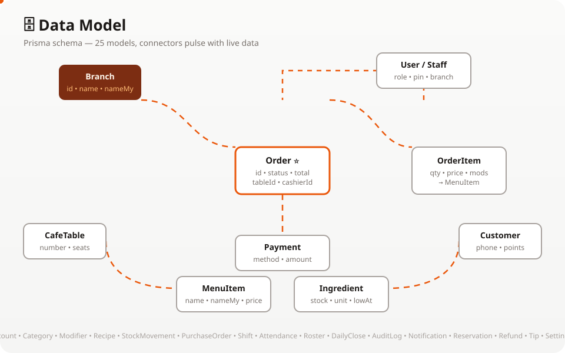

---

## ⚡ Tech stack

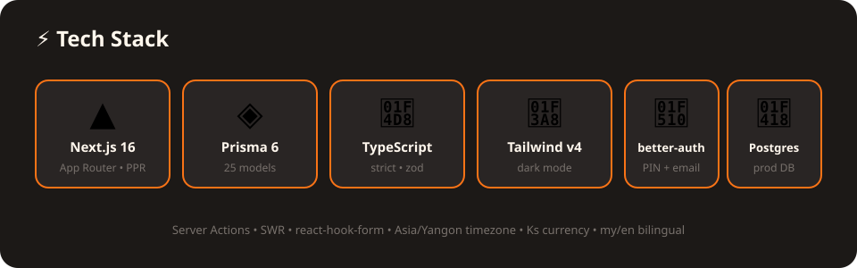

- **Next.js 16** (App Router) · **React 19** · **TypeScript** · **Tailwind CSS v4**
- **Prisma 6** · **PostgreSQL** (SQLite supported for quick local runs via `DB_PROVIDER`)
- **better-auth** (email + PIN sessions) · **react-hook-form + Zod** · **SWR**

---

## 🚀 Local development

Requires Node 22+ and PostgreSQL (or use the included SQLite path).

```bash
# 1. Install
npm install

# 2. Point at your database
#    (dev example — adapt to your own Postgres)
#    export DATABASE_URL="<redacted>"

# 3. Migrate + seed demo data
npx prisma migrate dev
npm run db:seed

# 4. Run
npm run dev   # http://localhost:3000
```

Useful scripts: `npm run build`, `npm run start`, `npx tsc --noEmit`, `npx prisma studio`.

### 🔐 Demo credentials (development only — change before real use!)

| Role | PIN | Email |
|---|---|---|
| Owner | `1234` | owner@cafe.local |
| Manager | `2345` | manager@cafe.local |
| Cashier | `3456` | cashier@cafe.local |
| Barista | `4567` | barista@cafe.local |

All seeded staff also accept the password `password123`.

---

## 🏗️ Project conventions

- Server Components by default; Server Actions start with session + RBAC checks, use Zod `safeParse`, branch-isolated Prisma access, and the shared `ActionResult<T>` (`src/lib/action-result.ts`).
- Prisma is server-side only (`src/lib/db.ts`). better-auth adapter provider follows `DB_PROVIDER` (`sqlite`|`postgresql`).
- i18n: every module registers `my`/`en` dictionaries in `src/lib/i18n/dictionaries.ts` — no raw keys in UI.
- RBAC ranks: barista → cashier → manager → owner. Menu reads are cashier+ (POS needs them); mutations are manager+.

---

## 🌍 Production deployment

Live at **https://linpyaecafe.kmnapps.xyz** — self-hosted VPS:

- **App:** `/opt/apps/linpyaecafe`, PM2 process `linpyaecafe` (port 3017)
- **Web:** nginx reverse proxy + HTTPS (Let's Encrypt)
- **DB:** PostgreSQL, role `linpyaecafe` owns database `linpyaecafedb`
- **Secrets** live in `/opt/apps/ecosystem.config.js` (mode 600) — never in the repo

To redeploy after local changes:

```bash
# from this dev machine:
tar czf - -C <srcdir> --exclude=node_modules --exclude=.git --exclude=.next --exclude="*.db" --exclude=.env . \
  | ssh vps "mkdir -p /opt/apps/linpyaecafe && tar xzf - -C /opt/apps/linpyaecafe"
ssh vps "cd /opt/apps/linpyaecafe && npm install --no-audit --no-fund \
  && npx prisma generate && npx prisma migrate deploy && npm run build \
  && pm2 restart linpyaecafe"
```

---

## 📜 License

MIT — see [LICENSE](LICENSE). Built with ☕ by **808 Coder**.

<div align="center">


</div>
